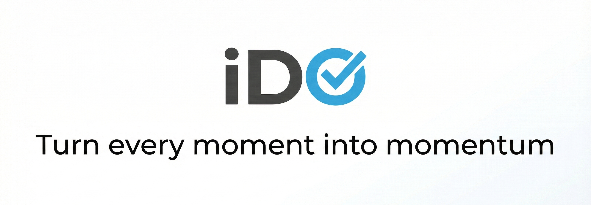
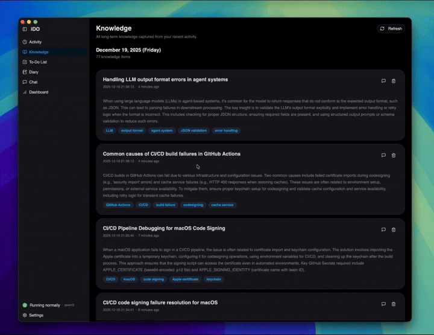
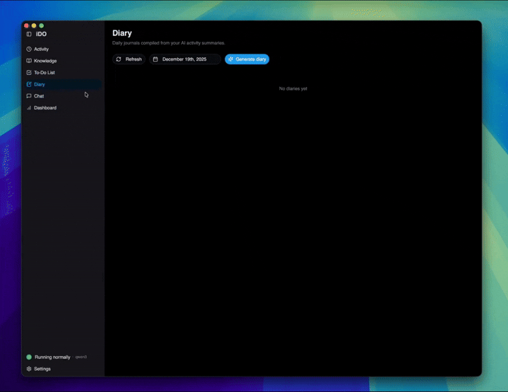
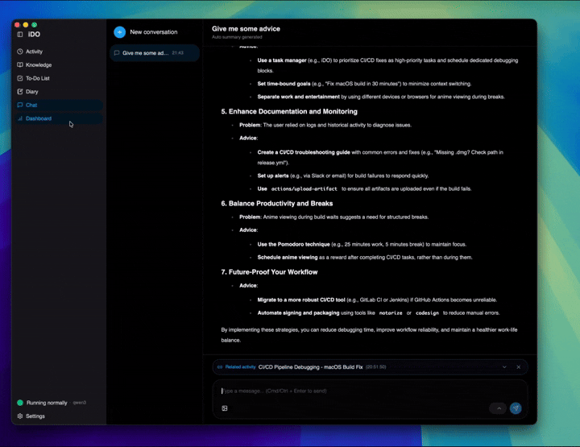
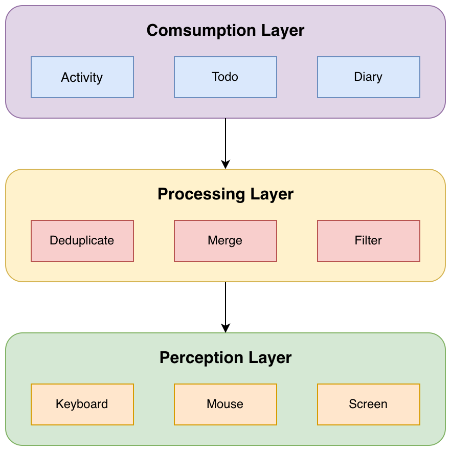

<picture>
  
</picture>

### iDO: Turn every moment into momentum

[English](README.md) | [简体中文](README.zh-CN.md)

A locally deployed AI desktop assistant that understands your activity stream, uses LLMs to summarize context, helps organize your work and knowledge, and recommends next steps—with all processing done entirely on your device.

---

## 🌟 Why iDO?

- **💻 Cross-Platform**: Works seamlessly on Windows and macOS
- **🔒 Privacy-First**: All data processing happens locally on your device
- **🤖 AI-Powered**: Intelligent activity summarization and context-aware task recommendations
- **🎯 Context-Aware**: Understands your work patterns and suggests next steps
- **🌍 Flexible**: Bring your own LLM provider (OpenAI, Claude, local models)
- **📊 Comprehensive**: Activity tracking, knowledge base, task management, and insights—all in one place

### Product Demos

#### Activity

Auto-grouped activity timeline with concise summaries so you can review sessions fast.

#### Knowledge

Turns daily activity into searchable knowledge cards for long-term recall.

#### To-do

Converts context into actionable tasks and lets you manage status and priority.

#### Diary

Builds a personal work diary with editable summaries and highlights.

#### Chat

Ask questions about your history and get grounded answers from your activity stream.

#### Dashboard

At-a-glance insights into focus, time use, and trends across days.

---

## 📐 How It Works

  

**iDO works in three intelligent layers**:

1. **Capture** - Monitors your screen and interactions silently in the background
2. **Process** - AI filters out noise and organizes meaningful activities
3. **Deliver** - Presents insights, tasks, and context when you need them

All processing happens locally on your device for maximum privacy.

📖 **[Learn more about the architecture →](docs/developers/architecture/README.md)**

---

## 🚀 Quick Start

**[Download the latest release →](https://github.com/UbiquantAI/iDO/releases/latest)**

Follow the installation guide to get started:

- 📖 **[Installation Guide →](docs/user-guide/installation.md)**
- 🎯 **[Features Overview →](docs/user-guide/features.md)**
- ❓ **[FAQ →](docs/user-guide/faq.md)**

**Want to contribute?** Check out the **[Developer Guide →](docs/developers/README.md)**

---

## 🎯 Key Features

### Privacy-First Design

- ✅ All data processing happens on your device
- ✅ No mandatory cloud uploads
- ✅ User-controlled LLM provider (bring your own API key)
- ✅ Open source and auditable

### Intelligent Activity Tracking

- 📊 Automatic activity detection and grouping
- 🖼️ Smart screenshot deduplication
- 🧠 LLM-powered summarization
- 🔍 Searchable activity timeline

### AI Task Recommendations

- 🤖 Plugin-based agent system
- ✅ Context-aware task suggestions
- 📝 Priority and status tracking
- 🔄 Continuous learning from your patterns

---

## 📖 Documentation

### 👥 For Users

| Guide                                                     | Description                    |
| --------------------------------------------------------- | ------------------------------ |
| **[Installation](docs/user-guide/installation.md)**       | Download and install iDO       |
| **[Features](docs/user-guide/features.md)**               | Learn about iDO's capabilities |
| **[FAQ](docs/user-guide/faq.md)**                         | Frequently asked questions     |
| **[Troubleshooting](docs/user-guide/troubleshooting.md)** | Fix common issues              |

📚 **[Complete User Guide →](docs/user-guide/README.md)**

### 💻 For Developers

Want to contribute or build on top of iDO?

📚 **[Complete Developer Documentation →](docs/developers/README.md)**

Quick links: [Setup](docs/developers/getting-started/README.md) • [Architecture](docs/developers/architecture/README.md) • [API Reference](docs/developers/reference/) • [Deployment](docs/developers/deployment/)

---

### 📚 Documentation Hub

**[docs/README.md](docs/README.md)** - Central documentation hub with quick navigation

---

## 🤝 Contributing

We welcome contributions! Whether you want to:

- 🐛 Report bugs or suggest features
- 📖 Improve documentation
- 💻 Submit code changes
- 🌍 Add translations

**[Read the Contributing Guide →](docs/developers/getting-started/development-workflow.md)** to learn how to get started.

---

## 📄 License

This project is licensed under the Apache License 2.0 - see the [LICENSE](LICENSE) file for details.

---

## 🙏 Acknowledgments

- Built with [Tauri](https://tauri.app/) - Modern desktop framework
- Powered by [PyTauri](https://pytauri.github.io/) - Python ↔ Rust bridge
- UI components from [shadcn/ui](https://ui.shadcn.com/)
- Icons from [Lucide](https://lucide.dev/)

---

## 👥 Maintainers

We are responsible for maintaining this project.

  
  

## 🙌 Contributors

We sincerely thank the following people for their active contributions.

  
  
  

---

**[📖 Documentation Hub](docs/README.md)** • **[👥 User Guide](docs/user-guide/README.md)** • **[💻 Developer Docs](docs/developers/README.md)** • **[🤝 Contribute](docs/developers/getting-started/development-workflow.md)**

Made with ❤️ by the iDO team

