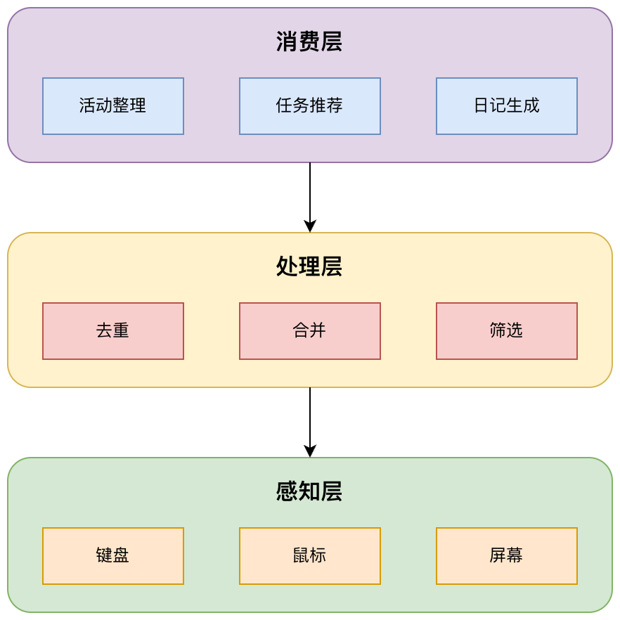

<picture>
  
</picture>

### iDO: Turn every moment into momentum

[English](README.md) | [简体中文](README.zh-CN.md)

本地部署的 AI 桌面助手，读懂你的活动流，使用 LLM 总结上下文，帮你整理所做的事情、所学的知识并推荐下一步任务——所有处理都在你的设备上完成。

---

## 🌟 为什么选择 iDO？

- **💻 跨平台支持**：在 Windows 和 macOS 上无缝运行
- **🔒 隐私优先**：所有数据处理都在你的设备本地完成
- **🤖 AI 驱动**：智能活动总结和上下文感知的任务推荐
- **🎯 懂你所需**：理解你的工作模式并建议下一步行动
- **🌍 灵活选择**：自带 LLM 提供商（OpenAI、Claude、本地模型）
- **📊 全面覆盖**：活动跟踪、知识库、任务管理和洞察分析——一站式解决

### 功能演示

#### 活动

自动聚合活动时间线并生成简明总结，快速回顾每个工作片段。

#### 知识

把日常活动转成可搜索的知识卡片，长期回忆更轻松。

#### 待办

从上下文中生成可执行任务，并支持状态与优先级管理。

#### 日记

自动生成个人工作日记，摘要可编辑、重点更清晰。

#### 聊天

围绕历史活动提问，获得有依据的上下文回答。

#### 仪表盘

一眼查看专注度、用时与趋势，掌握整体节奏。

---

## 📐 工作原理

  

**iDO 分三个智能层级工作**：

1. **捕获** - 在后台静默监控你的屏幕和交互
2. **处理** - AI 过滤噪音并组织有意义的活动
3. **呈现** - 在你需要时提供洞察、任务和上下文

所有处理都在你的设备本地完成，最大限度保护隐私。

📖 **[了解更多架构细节 →](docs/developers/architecture/README.md)**

---

## 🚀 快速开始

**[下载最新版本 →](https://github.com/UbiquantAI/iDO/releases/latest)**

按照安装指南快速上手：

- 📖 **[安装指南 →](docs/user-guide/installation.md)**
- 🎯 **[功能概览 →](docs/user-guide/features.md)**
- ❓ **[常见问题 →](docs/user-guide/faq.md)**

**想要贡献代码？** 查看 **[开发者指南 →](docs/developers/README.md)**

---

## 🎯 核心功能

### 隐私优先设计

- ✅ 所有数据处理都在你的设备上进行
- ✅ 无强制云上传
- ✅ 用户控制 LLM 提供商（使用自己的 API 密钥）
- ✅ 开源且可审计

### 智能活动跟踪

- 📊 自动活动检测和分组
- 🖼️ 智能截图去重
- 🧠 LLM 驱动的总结
- 🔍 可搜索的活动时间线

### AI 任务推荐

- 🤖 基于插件的 Agent 系统
- ✅ 上下文感知的任务建议
- 📝 优先级和状态跟踪
- 🔄 从你的使用模式中持续学习

---

## 📖 文档

### 👥 普通用户

| 指南                                               | 描述            |
| -------------------------------------------------- | --------------- |
| **[安装](docs/user-guide/installation.md)**        | 下载和安装 iDO  |
| **[功能](docs/user-guide/features.md)**            | 了解 iDO 的功能 |
| **[常见问题](docs/user-guide/faq.md)**             | 常见问题解答    |
| **[故障排除](docs/user-guide/troubleshooting.md)** | 解决常见问题    |

📚 **[完整用户指南 →](docs/user-guide/README.md)**

### 💻 开发者

想要贡献或基于 iDO 进行开发？

📚 **[完整开发者文档 →](docs/developers/README.md)**

快速链接：[环境搭建](docs/developers/getting-started/README.md) • [架构设计](docs/developers/architecture/README.md) • [API 参考](docs/developers/reference/) • [部署指南](docs/developers/deployment/)

---

### 📚 文档中心

**[docs/README.md](docs/README.md)** - 中央文档中心，快速导航

---

## 🤝 贡献

我们欢迎各种形式的贡献！无论你想要：

- 🐛 报告 bug 或提出功能建议
- 📖 改进文档
- 💻 提交代码更改
- 🌍 添加翻译

**[阅读贡献指南 →](docs/developers/getting-started/development-workflow.md)** 了解如何开始。

---

## 📄 许可证

本项目采用 Apache License 2.0 许可证 - 详见 [LICENSE](LICENSE) 文件。

---

## 🙏 致谢

- 基于 [Tauri](https://tauri.app/) 构建 - 现代桌面框架
- 由 [PyTauri](https://pytauri.github.io/) 驱动 - Python ↔ Rust 桥接
- UI 组件来自 [shadcn/ui](https://ui.shadcn.com/)
- 图标来自 [Lucide](https://lucide.dev/)

---

## 👥 Maintainers

我们负责维护这个项目。

  
  

## 🙌 Contributors

我们非常感谢以下人员的积极贡献。

  
  

---

**[📖 文档中心](docs/README.md)** • **[👥 用户指南](docs/user-guide/README.md)** • **[💻 开发者文档](docs/developers/README.md)** • **[🤝 贡献](docs/developers/getting-started/development-workflow.md)**

iDO 团队用 ❤️ 制作

